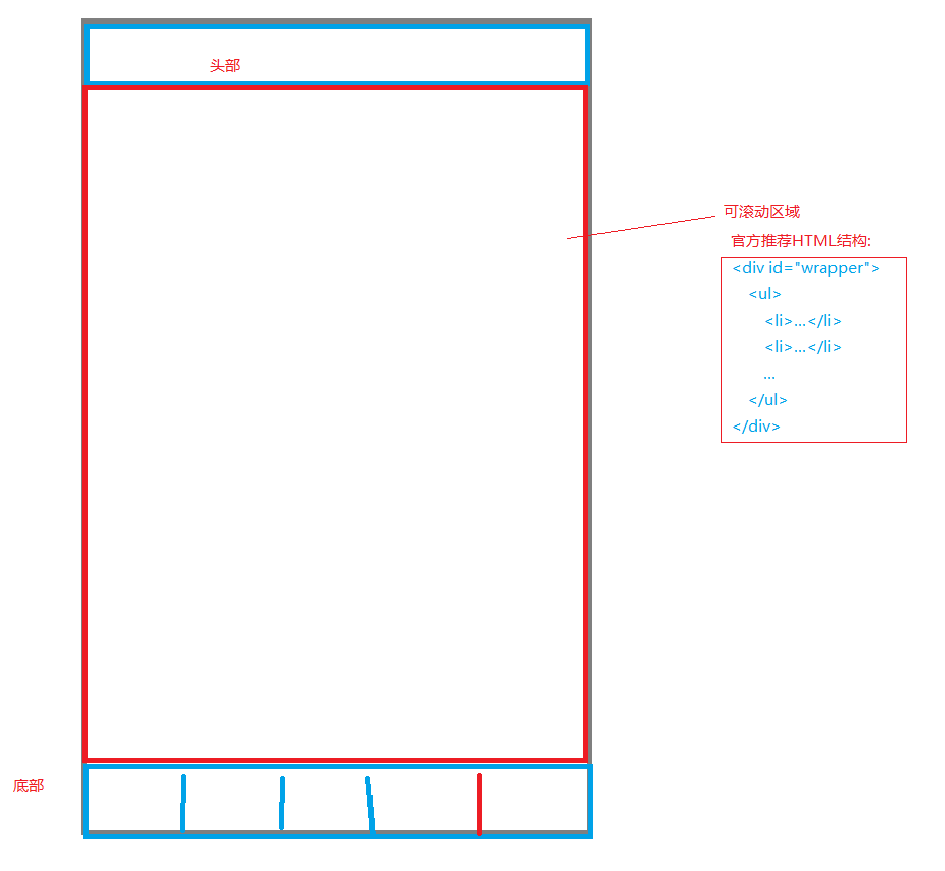
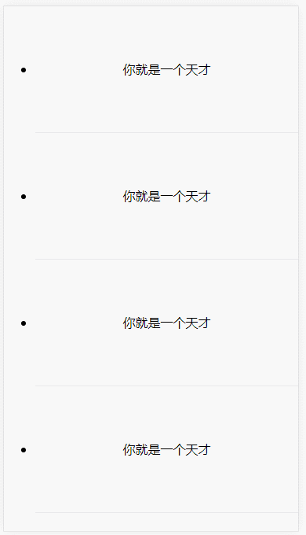
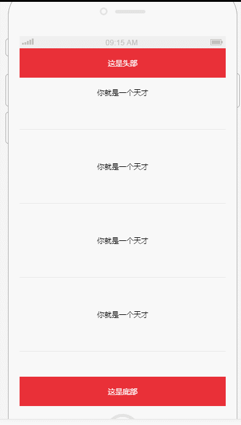

# iscroll 上拉刷新极简入门案例


* 注意:只有当内容超出屏幕区域才可以上拉刷新呢





## 演示






## 使用步骤

### 1:编写html页面,并引入相应js文件

```html
<!DOCTYPE html>
<html lang="en">

	<head>
		<meta charset="UTF-8">
		<meta name="viewport" content="width=device-width,initial-scale=1.0,minimum-scale=1.0,maximum-scale=1.0,user-scalable=no" />
		<!--<link rel="stylesheet" href="css/style.css">-->
			<!--引入js文件-->
		<script src="js/jquery.min.js"></script>
		<script src="js/iscroll.js"></script>
	
		<title>上拉加载更多</title>
	</head>

	<body>
		<!--<header>这是头部</header>-->
		<!--id为 wrapper 表示这个div是滑动的父窗体-->
		<div id="wrapper">
			<!--scroller 表示这是个可以滑动的控件-->
			<div class="scroller">
				<ul>
					<li>你就是一个天才</li>
					<li>你就是一个天才</li>
					<li>你就是一个天才</li>
					<li>你就是一个天才</li>
					<li>你就是一个天才</li>
				</ul>
				<!--这是上拉刷新的提示信息,会自动隐藏,样式完全可以自己定义-->
				<div class="more"><i class="pull_icon"></i><span>上拉加载...</span></div>
			</div>
		</div>
		<!--<footer>这是底部</footer>-->
	</body>

</html>
```

要想这个 div可以被滑动,对于 id为 wrapper 的div我们必须加如下的设置

```html

			#wrapper {
				width: 100%;/*必须*/
				position: absolute;/*必须*/
				left: 0;/*必须*/
				top: -1rem;/*必须[如果有头部,可以设置为头部的高度]*/
				bottom: 0rem;/*必须[如果有底部导航栏,这里可以设置底部导航栏的高度]*/
				overflow: hidden;/*规定当元素内部的内容超出元素自身的尺寸范围时应该如何来处理*/
				z-index: 1;/*层相对于屏幕纵深方向的顺序*/
				background-color: #ccc;/*背景颜色*/
			}
```


注意上拉刷新的显示等待信息也是个 html 定义,

```html
<!--这是上拉刷新的提示信息,会自动隐藏,样式完全可以自己定义-->
				<div class="more"><i class="pull_icon"></i><span>上拉加载...</span></div>
```
所以我们完全可以定义为我们自己想要的样式,我定义的如下:这完全是为了好看

```html
<style>
			#wrapper {
				width: 100%;/*必须*/
				position: absolute;/*必须*/
				left: 0;/*必须*/
				top: -1rem;/*必须[如果有头部,可以设置为头部的高度]*/
				bottom: 0rem;/*必须[如果有底部导航栏,这里可以设置底部导航栏的高度]*/
				overflow: hidden;/*规定当元素内部的内容超出元素自身的尺寸范围时应该如何来处理*/
				z-index: 1;/*层相对于屏幕纵深方向的顺序*/
				background-color: #ccc;/*背景颜色*/
			}
			
			#wrapper li {
				height: 10rem;
				line-height: 10rem;
				text-align: center;
				border-bottom: 1px solid rgba(0, 0, 0, .1);
			}
			
			.more {
				height: 4rem;
				display: flex;
				align-items: center;
				justify-content: center;
				color: #333;
			}
			
			.pull_icon {
				width: 25px;
				height: 25px;
				background-image: url('images/pull.png');
				background-repeat: no-repeat;
				background-position: center;
				background-size: 25px;
				transition: all .5s;
			}
			
			.more span {
				padding-left: .5rem;
			}
			
			.scroller {
				background-color: #fff;
			}
			
			.more .flip {
				transform: rotate(180deg);
			}
			
			.loading {
				background-image: url('images/loading.png');
				background-repeat: no-repeat;
				background-position: center;
				background-size: 25px;
			}
			
			.more .loading {
				-webkit-transform: rotate(0deg) translateZ(0);
				-webkit-transition-duration: 0;
				-webkit-animation-name: loading;
				-webkit-animation-duration: 2s;
				-webkit-animation-iteration-count: infinite;
				-webkit-animation-timing-function: linear;
			}
		</style>
```

### 2: 初始化 iscroll.js

```js
<script>
			var myscroll = new iScroll("wrapper", {
				onScrollMove: function() {
					if(this.y < (this.maxScrollY)) {
						$('.pull_icon').addClass('flip');
						$('.pull_icon').removeClass('loading');
						$('.more span').text('释放加载...');
					} else {
						$('.pull_icon').removeClass('flip loading');
						$('.more span').text('上拉加载...')
					}
				},
				//滚动到屏幕底部触发此事件
				onScrollEnd: function() {
					if($('.pull_icon').hasClass('flip')) {
						$('.pull_icon').addClass('loading');
						$('.more span').text('加载中...');
						//自己的事件(上拉刷新事件)
						pullUpAction();
					}

				},
				onRefresh: function() {
					$('.more').removeClass('flip');
					$('.more span').text('上拉加载...');
				}

			});

			//上拉刷新
			function pullUpAction() {
				setTimeout(function() {
					//填充数据
					for(var i = 0; i < 5; i++) {
						$('.scroller ul').append("<li>一只将死之猿!</li>");
					}
					myscroll.refresh();
				}, 1000)
			}
			if($('.scroller').height() < $('#wrapper').height()) {
				$('.more').hide();
				myscroll.destroy();
			}
		</script>
```

如果你不想了解细节,只需要关注 pullUpAction() 方法的实现即可,在此填充数据.

至此一个上拉刷新的功能就完成了.


## 完整页面布局:


```html
<!DOCTYPE html>
<html lang="en">

	<head>
		<meta charset="UTF-8">
		<meta name="viewport" content="width=device-width,initial-scale=1.0,minimum-scale=1.0,maximum-scale=1.0,user-scalable=no" />
		<!--<link rel="stylesheet" href="css/style.css">-->
		<script src="js/jquery.min.js"></script>
		<script src="js/iscroll.js"></script>
		<style>
			#wrapper {
				width: 100%;/*必须*/
				position: absolute;/*必须*/
				left: 0;/*必须*/
				top: -1rem;/*必须[如果有头部,可以设置为头部的高度]*/
				bottom: 0rem;/*必须[如果有底部导航栏,这里可以设置底部导航栏的高度]*/
				overflow: hidden;/*规定当元素内部的内容超出元素自身的尺寸范围时应该如何来处理*/
				z-index: 1;/*层相对于屏幕纵深方向的顺序*/
				background-color: #ccc;/*背景颜色*/
			}
			
			#wrapper li {
				height: 10rem;
				line-height: 10rem;
				text-align: center;
				border-bottom: 1px solid rgba(0, 0, 0, .1);
			}
			
			.more {
				height: 4rem;
				display: flex;
				align-items: center;
				justify-content: center;
				color: #333;
			}
			
			.pull_icon {
				width: 25px;
				height: 25px;
				background-image: url('images/pull.png');
				background-repeat: no-repeat;
				background-position: center;
				background-size: 25px;
				transition: all .5s;
			}
			
			.more span {
				padding-left: .5rem;
			}
			
			.scroller {
				background-color: #fff;
			}
			
			.more .flip {
				transform: rotate(180deg);
			}
			
			.loading {
				background-image: url('images/loading.png');
				background-repeat: no-repeat;
				background-position: center;
				background-size: 25px;
			}
			
			.more .loading {
				-webkit-transform: rotate(0deg) translateZ(0);
				-webkit-transition-duration: 0;
				-webkit-animation-name: loading;
				-webkit-animation-duration: 2s;
				-webkit-animation-iteration-count: infinite;
				-webkit-animation-timing-function: linear;
			}
		</style>
		<title>上拉加载更多</title>
	</head>

	<body>
		<!--<header>这是头部</header>-->
		<!--id为 wrapper 表示这个div是滑动的父窗体-->
		<div id="wrapper">
			<!--scroller 表示这是个可以滑动的控件-->
			<div class="scroller">
				<ul>
					<li>你就是一个天才</li>
					<li>你就是一个天才</li>
					<li>你就是一个天才</li>
					<li>你就是一个天才</li>
					<li>你就是一个天才</li>
				</ul>
				<!--这是上拉刷新的提示信息,会自动隐藏,样式完全可以自己定义-->
				<div class="more"><i class="pull_icon"></i><span>上拉加载...</span></div>
			</div>
		</div>
		<!--<footer>这是底部</footer>-->
		<script>
			var myscroll = new iScroll("wrapper", {
				onScrollMove: function() {
					if(this.y < (this.maxScrollY)) {
						$('.pull_icon').addClass('flip');
						$('.pull_icon').removeClass('loading');
						$('.more span').text('释放加载...');
					} else {
						$('.pull_icon').removeClass('flip loading');
						$('.more span').text('上拉加载...')
					}
				},
				//滚动到屏幕底部触发此事件
				onScrollEnd: function() {
					if($('.pull_icon').hasClass('flip')) {
						$('.pull_icon').addClass('loading');
						$('.more span').text('加载中...');
						//自己的事件(上拉刷新事件)
						pullUpAction();
					}

				},
				onRefresh: function() {
					$('.more').removeClass('flip');
					$('.more span').text('上拉加载...');
				}

			});

			//上拉刷新
			function pullUpAction() {
				setTimeout(function() {
					//填充数据
					for(var i = 0; i < 5; i++) {
						$('.scroller ul').append("<li>一只将死之猿!</li>");
					}
					myscroll.refresh();
				}, 1000)
			}
			if($('.scroller').height() < $('#wrapper').height()) {
				$('.more').hide();
				myscroll.destroy();
			}
		</script>
	</body>

</html>
```

## 更多 

具体配置信息请去官网查看.
